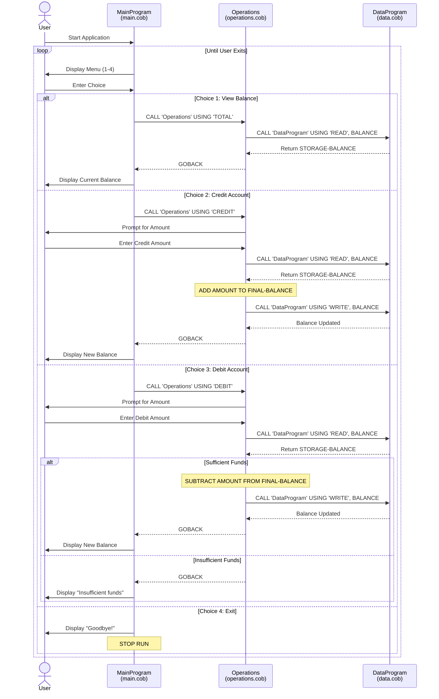

# Student Account Management System - COBOL Documentation

## Overview

This COBOL application implements a **Student Account Management System** that allows users to manage student account balances through a menu-driven interface. The system supports viewing balances, crediting funds, and debiting funds from student accounts.

---

## File Structure

```
src/cobol/
├── main.cob        # Main program entry point and menu system
├── operations.cob  # Business logic for account operations
└── data.cob        # Data storage and retrieval layer
```

---

## File Descriptions

### 1. main.cob - Main Program

**Program ID:** `MainProgram`

**Purpose:**  
Serves as the entry point for the application. Provides a menu-driven interface for users to interact with the student account management system.

**Key Functions:**

| Function | Description |
|----------|-------------|
| `MAIN-LOGIC` | Main procedure that displays the menu and processes user input in a loop |

**Menu Options:**
1. **View Balance** - Displays the current account balance
2. **Credit Account** - Adds funds to the account
3. **Debit Account** - Withdraws funds from the account
4. **Exit** - Terminates the program

**Data Elements:**
- `USER-CHOICE` (PIC 9) - Stores the user's menu selection (1-4)
- `CONTINUE-FLAG` (PIC X(3)) - Controls the main loop ('YES' to continue, 'NO' to exit)

---

### 2. operations.cob - Operations Module

**Program ID:** `Operations`

**Purpose:**  
Contains the core business logic for all account operations. Acts as an intermediary between the main program and the data layer.

**Key Functions:**

| Operation | Description |
|-----------|-------------|
| `TOTAL` | Retrieves and displays the current account balance |
| `CREDIT` | Adds a specified amount to the account balance |
| `DEBIT` | Subtracts a specified amount from the account balance (with validation) |

**Data Elements:**
- `OPERATION-TYPE` (PIC X(6)) - Stores the type of operation to perform
- `AMOUNT` (PIC 9(6)V99) - Stores the amount for credit/debit operations (up to 999,999.99)
- `FINAL-BALANCE` (PIC 9(6)V99) - Holds the account balance during operations

**Linkage Section:**
- `PASSED-OPERATION` (PIC X(6)) - Receives the operation type from the calling program

---

### 3. data.cob - Data Storage Module

**Program ID:** `DataProgram`

**Purpose:**  
Provides a data access layer for reading and writing account balance information. Simulates persistent storage using working storage variables.

**Key Functions:**

| Operation | Description |
|-----------|-------------|
| `READ` | Returns the current stored balance to the calling program |
| `WRITE` | Updates the stored balance with a new value |

**Data Elements:**
- `STORAGE-BALANCE` (PIC 9(6)V99) - The persistent balance storage, initialized to 1000.00
- `OPERATION-TYPE` (PIC X(6)) - Internal copy of the requested operation

**Linkage Section:**
- `PASSED-OPERATION` (PIC X(6)) - Receives the operation type ('READ' or 'WRITE')
- `BALANCE` (PIC 9(6)V99) - Used to pass balance values between programs

---

## Business Rules

### Student Account Rules

1. **Initial Balance**
   - All student accounts start with an initial balance of **$1,000.00**

2. **Balance Limits**
   - Maximum balance: **$999,999.99** (defined by PIC 9(6)V99)
   - Minimum balance: **$0.00** (no negative balances allowed)

3. **Credit Operations**
   - Any positive amount can be credited to the account
   - No upper limit validation on individual credit transactions
   - Balance is updated immediately after crediting

4. **Debit Operations**
   - Debits are only processed if sufficient funds are available
   - **Insufficient Funds Rule:** If the debit amount exceeds the current balance, the transaction is rejected with the message: "Insufficient funds for this debit."
   - Balance is updated immediately after successful debit

5. **Balance Precision**
   - All monetary values are stored with **2 decimal places**
   - Maximum of **6 digits** before the decimal point

---

## Program Flow

```
┌─────────────────┐
│   MainProgram   │
│   (main.cob)    │
└────────┬────────┘
         │
         │ CALL 'Operations'
         ▼
┌─────────────────┐
│   Operations    │
│(operations.cob) │
└────────┬────────┘
         │
         │ CALL 'DataProgram'
         ▼
┌─────────────────┐
│  DataProgram    │
│   (data.cob)    │
└─────────────────┘
```

---

## Usage Example

```
--------------------------------
Account Management System
1. View Balance
2. Credit Account
3. Debit Account
4. Exit
--------------------------------
Enter your choice (1-4): 1
Current balance: 1000.00

Enter your choice (1-4): 2
Enter credit amount: 500.00
Amount credited. New balance: 1500.00

Enter your choice (1-4): 3
Enter debit amount: 2000.00
Insufficient funds for this debit.

Enter your choice (1-4): 4
Exiting the program. Goodbye!
```

---

## Technical Notes

- The system uses COBOL's `CALL` statement for inter-program communication
- Data persistence is simulated using `WORKING-STORAGE SECTION` variables
- The `GOBACK` statement is used to return control to calling programs
- Input validation is implemented for menu choices (1-4 only)

---

## Sequence Diagram

The following diagram illustrates the data flow between components for each operation:


